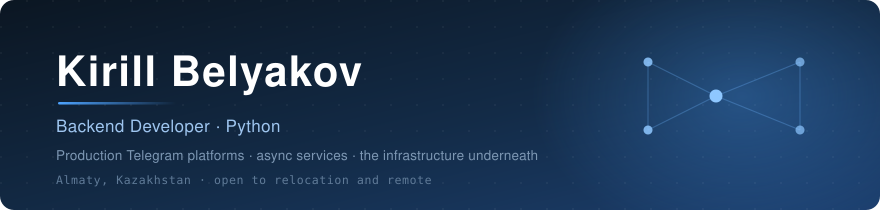
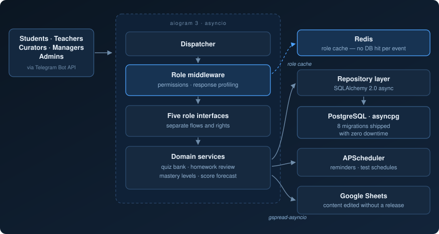
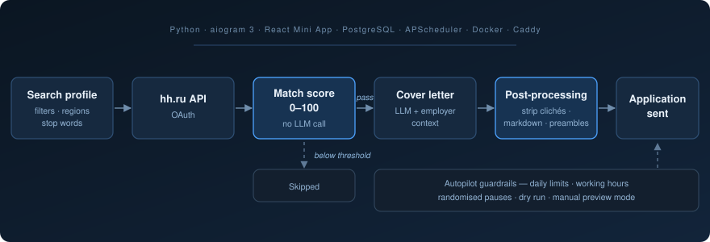

  
  
  
  

---

I write backend systems that other people depend on. For the past sixteen months I have been
the only developer on an EdTech platform that a few hundred students, teachers and managers
open every day — which means I have also been the only person on call when it breaks. That
turns out to be an unusually fast way to learn what production actually costs.

Most of my work lives in Telegram: asynchronous services, PostgreSQL schemas, role systems,
and the deployment underneath them.

 

<table>
  <tr>
    <td align="center"><b>~63,000</b> lines of Python in production</td>
    <td align="center"><b>630+</b> commits, sole author</td>
    <td align="center"><b>100+</b> paying subscribers</td>
    <td align="center"><b>5</b> role interfaces, one codebase</td>
    <td align="center"><b>8</b> live migrations, zero downtime</td>
    <td align="center"><b>16 mo</b> running it alone</td>
  </tr>
</table>

 

## What I build

### SchoolPro — EdTech platform for national exam preparation

<b>Production since May 2025</b> · sole developer · commercial contract

Students prepare for the UNT, teachers grade their homework, curators track groups and
managers watch the numbers — all inside Telegram. I designed the architecture, wrote the
code, deployed it, and maintain it while it is live.

<b>Engineering decisions worth explaining</b>

 

**Role checks stopped hitting the database.** Every incoming Telegram event used to resolve
the user's role with a query. Under five role types and constant polling that is a lot of
identical reads for data that almost never changes. Access control moved into middleware
with a Redis-backed role cache, and the per-event database round trip disappeared.

**Content editors do not wait for releases.** Curriculum material is authored by
methodologists, not by me. Two-way synchronisation with Google Sheets through
`gspread-asyncio` means they edit in a spreadsheet and the bot picks the change up — no
deploy, no ticket, no developer in the loop.

**Migrations run against a live database.** Eight Alembic revisions have shipped while the
service was serving users. Each one is its own pass with a backup and a written rollback
plan, because the alternative is discovering the problem from a student who cannot open
their homework.

**Operations are part of the job, not someone else's.** 23 pytest suites, profiling
middleware that logs response times per handler, structured logs prefixed by subsystem,
Docker with separate dev and prod configurations on a Linux VPS, and 18 documents covering
the schema, infrastructure and deploy procedure — written as the code was written.

 

### hh_mogger — job search automation as a Telegram Mini App

Personal project · 11,000 lines of Python · 2,900 of TypeScript

Applying to jobs by hand is slow, and cover letters written at volume all sound identical.
This fixes both without becoming a spam machine — the limits are deliberate.

<b>Why the letters don't read like a model wrote them</b>

 

Three layers, in order of how much they matter:

1. **The prompt forbids the tells.** 26 specific pieces of filler are banned outright, along
   with markdown and enumerated connectives. The model is required to name one concrete
   detail from the vacancy and one fact from the applicant's experience that carries a
   number. Varied paragraph length and at least one short sentence are asked for explicitly.
2. **Post-processing cleans what survives.** Preambles ("Sure! Here is your letter:"),
   markdown, bullet lists, wrapping quotes and trailing model commentary are stripped
   programmatically rather than hoped away.
3. **Scoring never touches the model at all.** The 0–100 match is computed locally from
   skill overlap, seniority, salary and work format — instant, free, and it means the LLM is
   only invoked for vacancies actually worth applying to.

The Mini App front end is React and TypeScript inside Telegram, with Caddy in front and
three Compose configurations for local, HTTPS and Postgres setups.

 

### ANOMIA — commercial visual novel

Released and monetised on itch.io and Patreon

A shipped commercial product, and the reason I now know what a build pipeline is worth.

- **49,000 lines** of gameplay code — turn-based combat, talent and level progression, a
  scene gallery, and save-state migrations that keep old saves loading across releases
- **A 6,500-line Python asset pipeline** written from scratch: batch generation through the
  ComfyUI API, contact-sheet assembly for review, automated installation of approved assets
  into the project tree
- Full story translated into English

 

## Stack

<table>
  <tr>
    <td><b>Languages</b></td>
    <td>
      
      
      
      
    </td>
  </tr>
  <tr>
    <td><b>Backend</b></td>
    <td>
      
      
      
      
      
      
    </td>
  </tr>
  <tr>
    <td><b>Data</b></td>
    <td>
      
      
      
      
      
      
    </td>
  </tr>
  <tr>
    <td><b>Infrastructure</b></td>
    <td>
      
      
      
      
      
      
    </td>
  </tr>
  <tr>
    <td><b>Front end</b></td>
    <td>
      
      
    </td>
  </tr>
  <tr>
    <td><b>Quality</b></td>
    <td>
      
      
      
    </td>
  </tr>
  <tr>
    <td><b>Integrations</b></td>
    <td>
      
      
      
      
      
    </td>
  </tr>
</table>

 

## How I work

**Documentation ships with the change, not after it.** The platform repository carries 18
documents on schema, infrastructure and deploy — written while the code was written, because
reconstructed documentation is fiction.

**Refactoring takes one whole layer at a time.** Infrastructure, then constants, then
navigation, then schema — each brought to a working state before the next begins. Scattered
half-finished edits across a live system is how outages happen.

**The service stays up while I work on it.** Every change has to leave it running. Schema
changes get their own pass, with a backup and a rollback plan written before anything moves.

**Names carry the explanation.** A constant called `WARMTH_PUBLIC_SUPPORT` needs no comment;
a bare `5` needs a paragraph. I would rather spend the effort on the name.

 

## Why this profile has no public repositories

The client work sits under contract and the rest is commercial. Nothing described above is a
tutorial project or a weekend experiment — it is code that is running right now with people
on the other end of it.

I am glad to walk through any of it: a read-through on a call, or repository access on
request. Good questions to ask me — how role caching changed the event path, what the
zero-downtime migration procedure actually looks like, or why the match scoring deliberately
never calls a language model.

 

  <a href="mailto:kbelakov88@gmail.com"><b>kbelakov88@gmail.com</b></a>
  &nbsp;·&nbsp;
  +7 705 567 60 90

