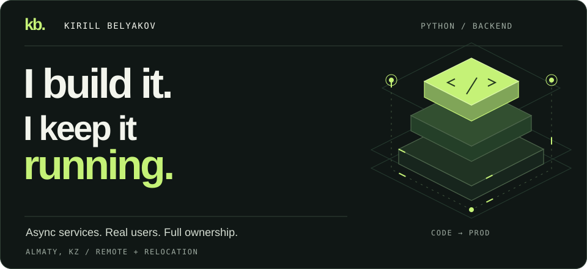
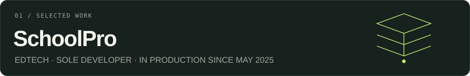
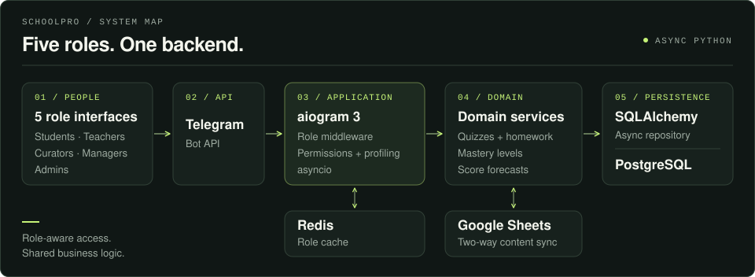
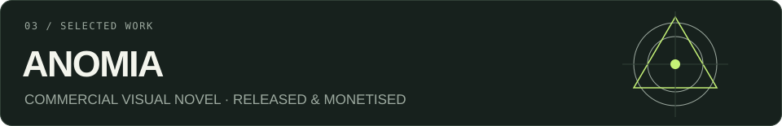
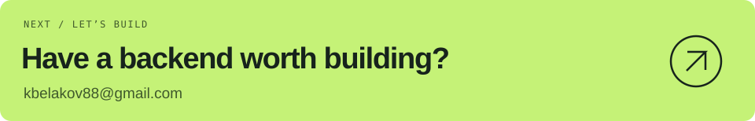

<picture>
  <source media="(max-width: 600px)" srcset="assets/hero-mobile.svg">
  
</picture>

  <a href="#selected-work">Selected work</a> &nbsp; / &nbsp;
  <a href="#stack">Stack</a> &nbsp; / &nbsp;
  <a href="mailto:kbelakov88@gmail.com">Let's talk ↗</a>

I build Python backends for products people use every day: asynchronous services, databases, and the infrastructure underneath. **From the first schema to the production incident, I own the whole path.**

Almaty, Kazakhstan · Open to remote work &amp; relocation · Russian C2 / English B2

## Selected work

<picture>
  <source media="(max-width: 600px)" srcset="assets/schoolpro-title-mobile.svg">
  
</picture>

**A school day, inside Telegram.** Students prepare for the UNT, teachers review homework, and curators and managers keep things moving. I designed, built, deployed, and maintain the platform.

<picture>
  <source media="(max-width: 600px)" srcset="assets/proof-mobile.svg">
  
</picture>

<b>Inside SchoolPro — architecture &amp; engineering decisions</b>

 

- **Fewer database reads.** Redis-backed role middleware removes repeated permission lookups from the event path.
- **Content without a release.** Methodologists update curriculum through two-way Google Sheets sync.
- **Changes with a way back.** Alembic migrations ship with backups and rollback plans.
- **Operations included.** Docker on Linux, handler profiling, structured logs, pytest, and deployment documentation.

 

<picture>
  <source media="(max-width: 600px)" srcset="assets/hh-mogger-title-mobile.svg">
  
</picture>

**Find the fit. Then write the letter.** A Telegram Mini App combining the hh.ru API, local vacancy scoring, and LLM-assisted cover letters. Matching runs locally; generation is reserved for relevant vacancies.

<b>Inside hh_mogger — matching, generation &amp; delivery</b>

Post-processing strips model preambles and formatting. Automated applications have deliberate rate limits. The frontend is React and TypeScript; the backend uses Python, OAuth, and Caddy.

 

<picture>
  <source media="(max-width: 600px)" srcset="assets/anomia-title-mobile.svg">
  
</picture>

**A game shipped. A pipeline built.** Commercial visual novel with turn-based combat, progression, and save-state migrations. Released on itch.io and Patreon, with an English translation.

<b>Inside ANOMIA — the asset pipeline</b>

A custom Python pipeline connects ComfyUI generation, contact sheets for review, and installation of approved assets into the project. Save-state migrations keep older saves loading across releases.

## Stack

**Backend** &nbsp; Python · asyncio · aiogram · FastAPI 
**Data** &nbsp; PostgreSQL · SQLAlchemy · Alembic · Redis 
**Delivery** &nbsp; Docker · Linux · Git · pytest 
**Interfaces** &nbsp; React · TypeScript · Telegram Mini Apps

<b>Where is the code?</b>

Client work is under contract; other projects are commercial. I can walk you through architecture, implementation decisions, and production trade-offs. Code walkthroughs and repository access are available where sharing is permitted.

 

<a href="mailto:kbelakov88@gmail.com">
  <picture>
    <source media="(max-width: 600px)" srcset="assets/contact-mobile.svg">
    
  </picture>
</a>

<a href="mailto:kbelakov88@gmail.com">kbelakov88@gmail.com</a> · Open to remote work &amp; relocation

